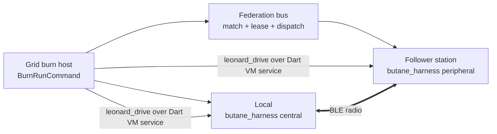

# Burn Workflow — grid-driven cross-device BLE integration

A burn uses `butane_grid_assets` to lease a follower station, launch one `butane_harness` in the peripheral role and one in the central role, drive the named scripted scenario through Leonard, and return a `TestReport`. The standalone coordinator and its custom WebSocket/mDNS control transport were retired by `butane_flutter-75t`.

## Topology

The federation bus carries lease, launch, and endpoint-rendezvous data. BLE commands and perception travel directly between `leonard_drive` and each harness's `ext.exploration.*` extension through the published Dart VM-service URI.

## Harness configuration

`ROLE` is the only harness configuration value. It must be `central` or `peripheral`; pass it as a Dart define on iOS and as an environment variable on desktop platforms. Launch debug or profile builds because release builds do not expose the Dart VM service Leonard needs.

## Run the follower station

    dart run butane_grid_assets:butane_station serve --kind burn \
      --harness-dir packages/butane_harness

## Run a burn from the host

    dart run butane_grid_assets:butane_station burn \
      --peer follower-host:port \
      --harness-dir packages/butane_harness \
      --scenario nus_round_trip \
      --bead butane_flutter-<id> \
      --no-dry-run

`--peer` is repeatable, `--peer-token` supplies the optional federation secret, `--follower-target` defaults to Linux, and `--no-local` suppresses the local central harness. Supported scenario names come from `kButaneScenarios` in `packages/butane_grid_assets/lib/src/burn/scenarios.dart`.

## Lifecycle and failure behavior

The follower order capability-matches a peer, leases it, dispatches a `LaunchSpec`, and publishes the follower VM-service endpoint. The host order launches the local harness, attaches one Leonard drive to each endpoint, executes the scripted steps, and collects the report. Disposal closes both drives and reaps launched process groups on success, scenario failure, denial, or cancellation.

## Validation

Use offline tests for the formula, routing, reporting, and teardown:

    cd packages/butane_grid_assets
    dart test test/burn_test.dart

The live two-radio proof is opt-in and self-skips unless its external prerequisites are present:

    cd packages/butane_grid_assets
    dart test test/two_drive_burn_live_test.dart
