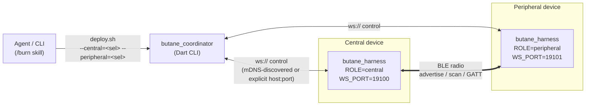

# Burn Workflow — cross-device BLE integration runs

A "burn" launches the [`butane_harness`](../packages/butane_harness) on
two devices, runs a scripted scenario through
[`butane_coordinator`](../packages/butane_coordinator), and writes a
pass/fail report to `.burns/`.

Agents invoke the `/burn` skill with two selectors; this doc describes
what that skill actually does so you can reproduce it by hand or debug
it when it fails.

## Topology



Each harness advertises `_butane-harness._tcp` over mDNS (via `nsd` on
Darwin, `avahi-publish-service` on Linux). The coordinator's
`--discover` flag resolves both sides without hardcoded IPs.

## Selectors

The `/burn` skill takes `central=<selector>` and
`peripheral=<selector>`. Selector kind determines the platform playbook
that gets loaded:

| Selector              | Platform | Probe                                |
|-----------------------|----------|--------------------------------------|
| `local`               | macOS    | this host                            |
| `udid:<UDID>`         | iOS      | `ios-deploy -c --timeout 5`          |
| `ssh:<user@host>`     | Linux    | `ssh -o ConnectTimeout=3 … true`     |
| `mdns:<service-name>` | any      | `dns-sd -B _butane-harness._tcp`     |
| `adb:<serial>`        | Android  | `adb devices` (not yet implemented)  |

Each selector is probed independently by
`.claude/skills/burn/scripts/probe.sh`; the first failure aborts the
burn before anything is built.

## Prerequisites

### macOS (central or peripheral)

- Flutter stable on `PATH`.
- Xcode signing team configured for `butane_harness` (team `D82YXVJWMT`
  in the current project).
- **TCC Bluetooth** granted to the app bundle. `flutter run` inherits
  the debug bypass, but standalone binaries do not. If
  `check_state` returns `unauthorized`, reset and re-grant:

  ```bash
  tccutil reset Bluetooth com.nicospencer.butaneHarness
  # Then launch once and approve in System Settings → Privacy & Security → Bluetooth.
  ```

- Do **not** run two `flutter run` commands from the same project dir at
  once — the second invalidates the first. Use separate `tmux` sessions
  (see Mac ↔ iPad walkthrough) or `flutter build` + `open -n`.

### iOS (peripheral only, for now)

- First-time Bluetooth and Local Network permissions must be granted on
  the device. They persist across rebuilds **but not** across reinstalls
  — so avoid `--uninstall` unless you're prepared to re-approve.
- Two identifiers are needed and they are different:
  - **UDID** (40-char, `00008110-…`) — from `flutter devices` or
    `ios-deploy -c --timeout 5`.
  - **CoreDevice UUID** (`D9EBF582-…`) — only consumed by `xcrun
    devicectl`. Map it with:

    ```bash
    xcrun devicectl list devices --json-output /tmp/dev.json
    jq -r --arg udid "$UDID" \
      '.result.devices[] | select(.hardwareProperties.udid == $udid) | .identifier' \
      /tmp/dev.json
    ```

- iOS reads config from `--dart-define` only (not runtime env), so
  `ROLE` and `WS_PORT` must be baked in at build time.

### Linux (central or peripheral)

Full setup: [`linux-dev-environment.md`](linux-dev-environment.md). In
particular:

- Bare repo at `~/butane_flutter.git` and a working clone at
  `~/butane_flutter` on the Linux host.
- Git remote named `linux` on the Mac pointing at the bare repo, e.g.
  `git remote add linux nico@nico-yoga-7-14itl5.local:~/butane_flutter.git`.
- SSH key auth from Mac → Linux (no password prompt);
  `ssh -o BatchMode=yes` must succeed.
- Flutter SDK at `~/flutter` on the Linux side, in `PATH` for
  non-interactive shells.
- `libdbus-1-dev`, `libbluetooth-dev`, and `avahi-utils` installed
  (the last provides `avahi-publish-service` for mDNS).
- `ControllerMode = le` in `/etc/bluetooth/main.conf` and
  `systemctl restart bluetooth` — BlueZ 5.72 will otherwise pick BR/EDR
  over LE for dual-mode peers and GATT will never resolve.

## Git remote topology

Builds on Linux are triggered by pushing to a remote that points at the
target's bare repo:

```
GitHub (origin)
     ↑ push
Mac Studio: ~/development/com.nicospencer/butane_flutter
     ↓ push (remote: linux)
Linux host: ~/butane_flutter.git   (bare repo)
     ↑ fetch
Linux host: ~/butane_flutter       (working clone — builds happen here)
```

`deploy.sh` enforces this:

1. Local working tree must be clean (`git diff --quiet &&
   git diff --cached --quiet`).
2. The `linux` remote must exist and its URL host must match the
   selector host.
3. The remote working tree must be clean.
4. `git -C <repo> push --force linux HEAD:refs/heads/burn` ships the
   current HEAD to a throwaway `burn` branch on the Linux side.
5. SSH into the target and `git checkout -B burn origin/burn` picks it
   up before `flutter pub get` and `flutter build linux --release`.

> `--force` is deliberate: `burn` is a short-lived build branch, not a
> shared branch. If you want to keep a commit around, push it to `main`
> (or a PR branch) first.

## Quick path — `/burn` skill

```
/burn central=local peripheral=udid:00008110-001651523CE3801E
/burn central=ssh:nico@nico-yoga-7-14itl5.local peripheral=local
/burn central=local peripheral=ssh:nico@nico-yoga-7-14itl5.local scenario=ble_flow bead=butane_flutter-8zx
```

The skill:

1. Runs `scripts/probe.sh` for each selector, fast-failing on missing
   tools or unreachable hosts.
2. Loads `references/platforms/<platform>.md` **only** for the platforms
   actually in use (macOS, iOS, Linux — progressive disclosure).
3. Runs `scripts/deploy.sh` to build + launch both harnesses and drive
   the coordinator. Combined stdout/stderr goes to
   `.burns/<UTC-iso>-<scenario>.log`.
4. Runs `scripts/report.sh` to emit sibling `.json` and `.md` reports.
   Pass/fail is determined by the last line matching
   `^Coordinator exited with code (\d+)$`.
5. If a `bead=` was provided, posts the report back to that issue via
   `bd`.
6. Teardown (always runs, even on failure): `pkill` the harness binary
   locally and on every SSH target; also `pkill -f
   '^avahi-publish-service '` on Linux hosts.

If the coordinator exits non-zero, the skill loads
`references/troubleshooting.md` before surfacing the failure.

## Manual walkthrough — Mac ↔ iPad

Central = Mac (CoreBluetooth), peripheral = iPad (CoreBluetooth).

```bash
# 1. Build + install on the iPad with dart-defines baked in.
cd packages/butane_harness
flutter build ios --release \
  --dart-define=ROLE=peripheral \
  --dart-define=WS_PORT=19101
ios-deploy --bundle build/ios/iphoneos/Runner.app \
  --id 00008110-001651523CE3801E --no-wifi | tail -3

# 2. Launch on the iPad via xcrun devicectl (needs the CoreDevice UUID,
#    not the UDID — see Prerequisites).
xcrun devicectl device process launch \
  --device D9EBF582-XXXXX... \
  --terminate-existing \
  com.nicospencer.butaneHarness

# 3. Launch the Mac central inside tmux — flutter run needs a real TTY
#    or it dies in ~30s.
tmux new-session -d -s butane_mac \
  "cd packages/butane_harness && flutter run -d macos \
     --dart-define=ROLE=central --dart-define=WS_PORT=19100"

# 4. Wait for both WS ports to come up.
until nc -z localhost 19100; do sleep 1; done
until nc -z <ipad-ip> 19101; do sleep 1; done

# 5. Run the coordinator. --discover resolves both sides via mDNS; the
#    explicit form is here for debugging.
dart run packages/butane_coordinator/bin/coordinator.dart \
  --central-port 19100 --peripheral-port 19101 \
  --host localhost --peripheral-host <ipad-ip> \
  --timeout 30 --runs 1

# 6. Teardown.
tmux kill-session -t butane_mac
xcrun devicectl device process terminate \
  --device D9EBF582-XXXXX... com.nicospencer.butaneHarness
```

## Manual walkthrough — Mac ↔ Linux

Central = Linux (BlueZ), peripheral = Mac (CoreBluetooth). Run these
commands from the Mac.

```bash
# 1. Preflight: clean tree, push to the Linux bare repo.
git diff --quiet && git diff --cached --quiet || { echo "dirty"; exit 1; }
git push --force linux HEAD:refs/heads/burn

# 2. Belt-and-braces: clear any stale harness + avahi on Linux.
ssh -o BatchMode=yes nico@nico-yoga-7-14itl5.local '
  pkill -x butane_harness 2>/dev/null
  pkill -f "^avahi-publish-service " 2>/dev/null
  true
' >/dev/null 2>&1 || true

# 3. Build on the Linux host.
ssh -o BatchMode=yes nico@nico-yoga-7-14itl5.local '
  set -e
  cd ~/butane_flutter
  git fetch origin
  git checkout -B burn origin/burn
  export PATH=$HOME/flutter/bin:$PATH
  flutter pub get
  cd packages/butane_harness
  flutter build linux --release
'

# 4. Launch the Linux central, backgrounded, with runtime env vars.
ssh -o BatchMode=yes nico@nico-yoga-7-14itl5.local '
  cd ~/butane_flutter/packages/butane_harness
  nohup env ROLE=central WS_PORT=19100 \
    ./build/linux/x64/release/bundle/butane_harness \
    > ~/.burn-harness.log 2>&1 &
  disown || true
'

# 5. Launch the Mac peripheral. `open -n` reads --env, so no rebuild
#    needed between runs.
flutter build macos --release
open -n packages/butane_harness/build/macos/Build/Products/Release/butane_harness.app \
  --env ROLE=peripheral --env WS_PORT=19101

# 6. Run the coordinator with mDNS discovery — neither side's IP is
#    pinned in code.
dart run packages/butane_coordinator/bin/coordinator.dart --discover --timeout 30

# 7. Teardown (also what deploy.sh does in its EXIT trap).
killall butane_harness 2>/dev/null || true
ssh -o BatchMode=yes nico@nico-yoga-7-14itl5.local '
  pkill -x butane_harness 2>/dev/null
  pkill -f "^avahi-publish-service " 2>/dev/null
  true
' >/dev/null 2>&1 || true
```

> Note the `^avahi-publish-service ` pattern (anchor + trailing space).
> `avahi-publish-service` is `nohup`'d alongside the harness and
> **won't** die with it; the anchor prevents `pkill` from matching the
> cleanup bash command itself.

## Dart-define / env-var reference

`HarnessConfig.fromEnvironment()`
(`packages/butane_harness/lib/src/config.dart`) reads dart-defines with
runtime-env fallback:

| Flag            | Required | Purpose                                   |
|-----------------|----------|-------------------------------------------|
| `ROLE`          | yes      | `central` or `peripheral`                 |
| `WS_PORT`       | yes      | WebSocket control port (server mode)      |
| `WS_RELAY_URL`  | no       | If set, harness dials out to a relay instead of listening (used by `tool/ws_relay.dart` when a host can't accept inbound connections) |

- **iOS**: `--dart-define=FLAG=VALUE` at build time (env is not readable).
- **macOS**: `open -n app --env FLAG=VALUE` at launch.
- **Linux**: `env FLAG=VALUE ./butane_harness` at launch.

## Report artifacts

Every burn writes three sibling files to `.burns/`:

```
20260417T005005Z-ble_flow.log    # combined deploy + coordinator output
20260417T005005Z-ble_flow.json   # {"scenario","result","exit_code","log","finished_at"}
20260417T005005Z-ble_flow.md     # same fields in human form
```

The filename timestamp is UTC ISO 8601 compacted
(`YYYYMMDDTHHMMSSZ`). `report.sh` is idempotent — you can re-run it
against an existing log to regenerate the `.json` / `.md` without
re-burning.

## Troubleshooting

- **`check_state` returns `unauthorized` on macOS** — TCC denied.
  `tccutil reset Bluetooth com.nicospencer.butaneHarness`, relaunch,
  approve.
- **Coordinator never connects** — check WS ports are actually listening
  (`nc -z <host> <port>`). On Linux, also check that
  `butane_harness` didn't crash during GATT registration
  (`tail ~/.burn-harness.log`).
- **Linux connects but `ServicesResolved` never flips** —
  `ControllerMode` is still `dual`. Fix and restart `bluetooth`, see
  [linux-dev-environment.md](linux-dev-environment.md).
- **SSH hangs** — missing `-o BatchMode=yes`. The agent environment
  can't answer interactive prompts; any `ssh` call that could prompt
  for a password, host key, or sudo will stall forever.
- **Second `flutter run` kills the first** — same project dir
  conflict. Split them into separate `tmux` sessions, or build once and
  launch the bundles directly.
- **SSH into a Mac Studio from another Mac fails with "No route to
  host"** — macOS Local Network permission is blocking you, and the
  approval prompt is on the Studio's physical console where an SSH user
  can't see it. Approve once at the console or via System Settings →
  Privacy & Security → Local Network.
