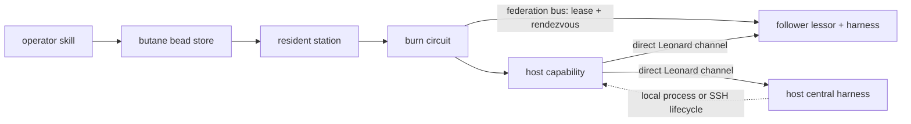

# Cross-device burn workflow

The burn is resident work. Its operator wrapper files a bead, the resident
station mounts the burn circuit, and the circuit records its result and
teardown receipts on the bead/session.

The two channels are orthogonal: the federation bus owns rendezvous and
lifecycle, while Leonard drives each harness directly. Perception is never
tunnelled through the bus.

The default central is macOS. A Windows central is selected with the optional
bead metadata below:

    burn.central_target=windows
    burn.windows_host=yoga-win
    burn.windows_repo=C:/Users/nicks/butane_flutter
    burn.windows_flutter=C:/Users/nicks/fvm/versions/stable/bin/flutter.bat

The corresponding environment fallbacks are `BURN_CENTRAL_TARGET`,
`BUTANE_WINDOWS_HOST`, `BUTANE_WINDOWS_REPO`, and `BUTANE_WINDOWS_FLUTTER`.

- `burn.follower_target` selects the resident follower launcher. It resolves
  from bead metadata, then `BURN_FOLLOWER_TARGET`, and defaults to `ios`.
  Set it to `macos` for a Windows-central + Mac-peripheral burn without an iPad.
- The macOS follower runs `butane_harness` in profile mode with
  `ROLE=peripheral`. The station and harness share the Mac; the c15 launch bound
  and w30 allocation teardown remain unchanged for both burn drives.
- macOS `CBPeripheralManager` add-service/advertise behavior through
  `ext.exploration.butane` is a runtime unknown: it has only been proven on the
  iPad. Harvest requires a bench-attended burn. On first run, the operator must
  accept the macOS Bluetooth permission prompt, then verify advertising and the
  Windows-central smoke receipt. Unit tests do not claim this runtime harvest
  proof.

SSH owns the Windows harness launch and process-tree reap. Because the Windows
Dart VM service binds loopback, SSH also owns a local `-L` forward from the
resident Mac's `127.0.0.1:<localPort>` to the Windows host's
`127.0.0.1:<vmServicePort>`; the central drive receives the Mac-loopback URI.
The follower Leonard channel remains direct point-to-point and no VM-service
URI rewrites loopback to the Windows hostname.

## File a burn

Invoke `/burn` with the follower peer, scenario, harness directory, target, and
local-central choice. The skill files or refines a deferred task in butane's
store. After you approve and bless that bead, the one resident station mounts
`kBurnCircuit`; no per-burn process boots a station.

## Read the result

Invoke `/burn <bead-id>` or run `bd show <bead-id>`. Report the recorded
follower endpoint/lease rendezvous, host `TestReport`, circuit state, artifacts,
and teardown receipt. A missing receipt means the work has not completed; it is
not success.

## Run the follower lessor

    dart run butane_grid_assets:butane_station serve --kind burn \
      --harness-dir packages/butane_harness

The lessor owns the follower lease server and dispatched follower process. It
does not mount work; the resident station drives the burn bead.

## Offline validation

    cd packages/butane_grid_assets
    dart pub get
    dart analyze
    dart test
