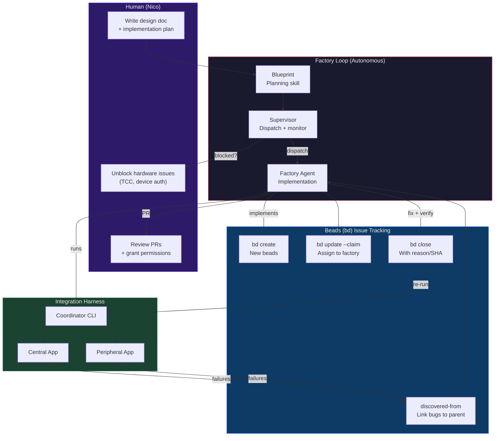
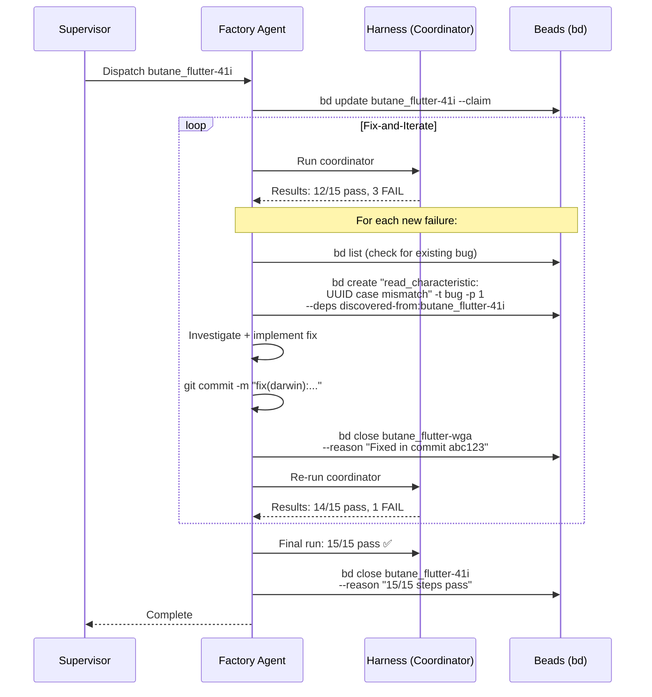
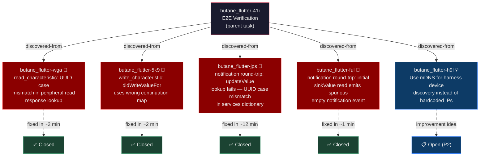
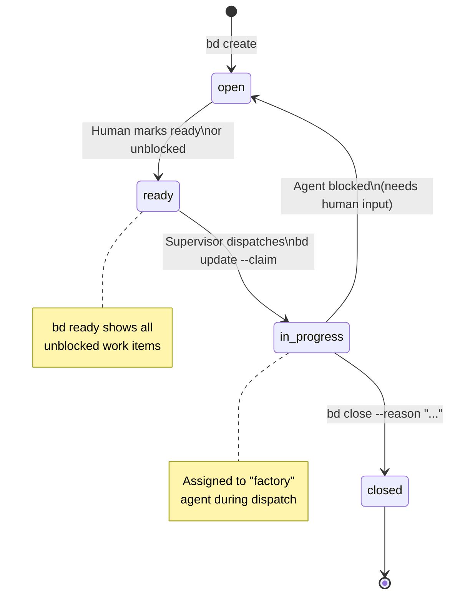
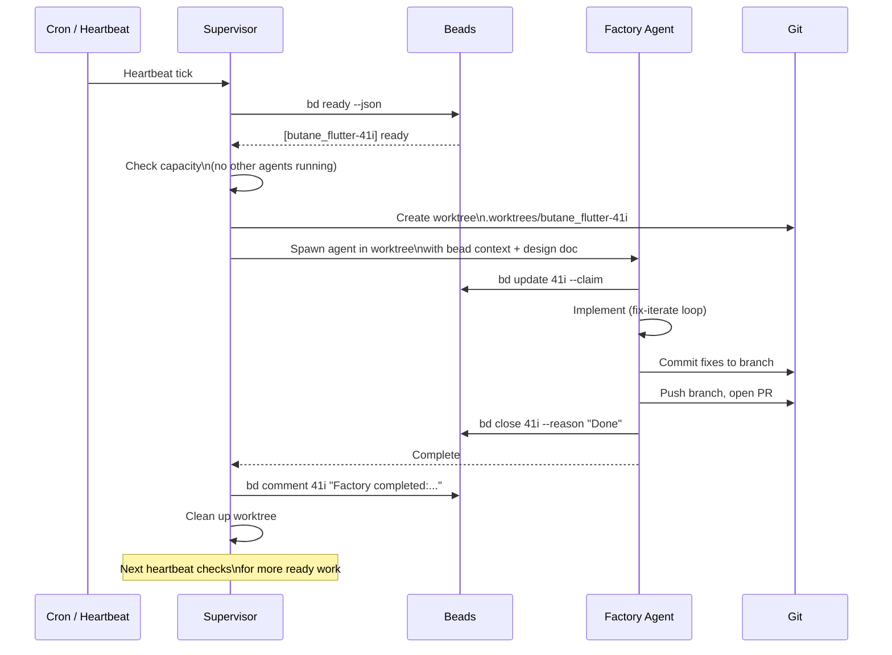
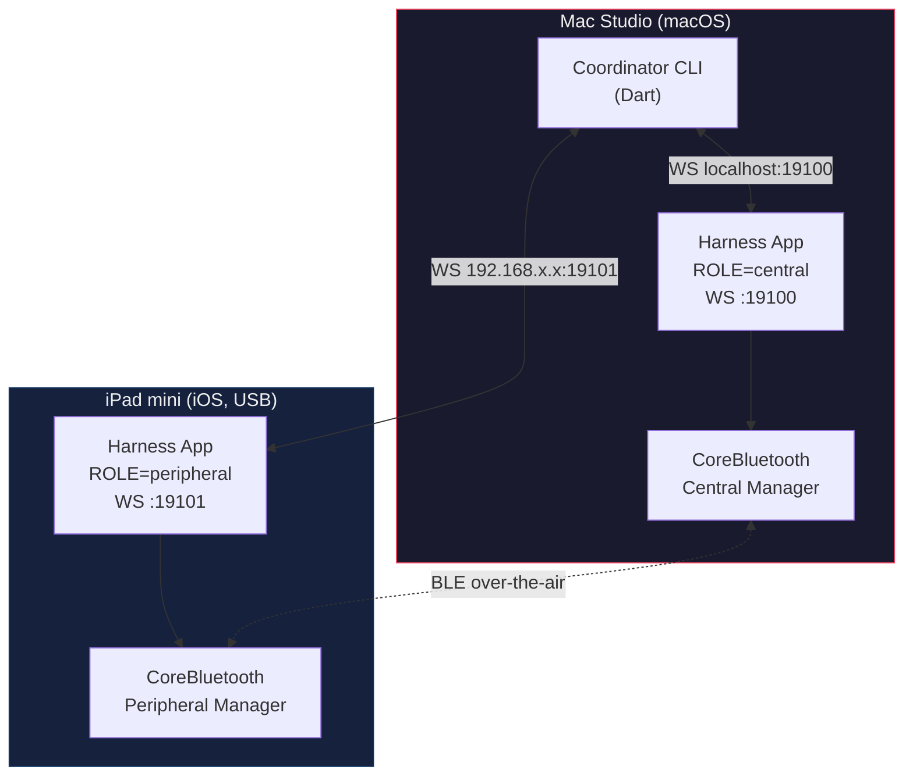

# Autonomous Integration Development Cycle

How butane_flutter's integration harness is built, tested, and maintained through an autonomous agent pipeline with beads-based issue tracking.

## The Pipeline

Three systems work together: the **factory loop** for autonomous implementation, **beads** (`bd`) for issue tracking and bug discovery, and the **harness** itself for validation.



## Phased Build-Out

The harness was built in phases, each tracked as beads with dependency chains. The factory loop executed each phase autonomously — planning decomposed the work, the supervisor dispatched agents, and factory agents implemented task-by-task.

```mermaid
flowchart LR
    subgraph Phase1["Phase 1: Pigeon API"]
        V5C["butane_flutter-v5c\nPigeon data models"]
        A44["butane_flutter-a44\nSubscription callbacks"]
    end

    subgraph Phase2["Phase 2: Platform Interface"]
        CF8["butane_flutter-cf8\nAbstract methods + channel impl"]
    end

    subgraph Phase3["Phase 3: Swift"]
        H9A["butane_flutter-h9a\nPeripheralManager.swift"]
    end

    subgraph Phase4["Phase 4: Dart Porcelain"]
        P70["butane_flutter-70p\nPeripheralManager class"]
    end

    subgraph Phase5["Phase 5: Harness App"]
        S6C["butane_flutter-6c8\nApp scaffold"]
        TPQ["butane_flutter-tpq\nCentral role"]
        UVV["butane_flutter-uvv\nPeripheral role"]
    end

    subgraph Phase6["Phase 6: Coordinator"]
        LIR["butane_flutter-lir\nCLI + launch script"]
        E2E["butane_flutter-41i\nE2E verification"]
    end

    V5C --> CF8
    A44 --> CF8
    CF8 --> H9A
    H9A --> P70
    P70 --> S6C
    S6C --> TPQ & UVV
    TPQ --> LIR
    UVV --> LIR
    LIR --> E2E

    style Phase1 fill:#16213e,stroke:#0f3460,color:#eee
    style Phase2 fill:#16213e,stroke:#0f3460,color:#eee
    style Phase3 fill:#16213e,stroke:#0f3460,color:#eee
    style Phase4 fill:#16213e,stroke:#0f3460,color:#eee
    style Phase5 fill:#16213e,stroke:#0f3460,color:#eee
    style Phase6 fill:#16213e,stroke:#0f3460,color:#eee
```



## Bug Discovery During E2E Verification

When the E2E verification bead (`butane_flutter-41i`) runs the harness, failures are tracked as bug beads linked via `discovered-from`. This creates an audit trail of what broke, what fixed it, and how it was found.



### Real Bug Discovery Chain

During the `butane_flutter-41i` E2E verification, four bugs were discovered and fixed autonomously:



## Beads Workflow

### Issue Lifecycle



### Dependency Types

| Type | Meaning | Example |
|------|---------|---------|
| `blocks` | Must complete before dependent can start | `lir` (coordinator) blocks `41i` (E2E) |
| `discovered-from` | Bug/idea found while working on parent | `wga` (UUID bug) discovered from `41i` (E2E run) |
| `parent-child` | Subtask of a larger bead | `v5c.1`, `v5c.2` are children of `v5c` |

### Beads Commands Used in This Project

```bash
# Check what's ready to work on
bd ready --json

# Create a feature bead
bd create "Peripheral Manager Pigeon API" \
  -t feature -p 2 --json

# Create a bug discovered during another task
bd create "UUID case mismatch in read response" \
  -t bug -p 1 \
  --deps discovered-from:butane_flutter-41i --json

# Claim and start working
bd update butane_flutter-41i --claim --json

# Close with context
bd close butane_flutter-41i \
  --reason "15/15 steps pass. Error forwarding implemented." --json

# View full issue with comments and deps
bd show butane_flutter-41i --json
```

## Supervisor Dispatch Cycle

The supervisor runs autonomously (via heartbeat/cron), checks for ready work, and dispatches factory agents:



## Cross-Device E2E Flow

The harness runs across two physical devices because CoreBluetooth can't do loopback (Central and Peripheral on the same Mac can't discover each other).



### Known Constraints

- **macOS TCC Bluetooth authorization** — `flutter clean` invalidates the Bluetooth permission grant. Rebuilding requires human to re-approve in System Settings. Headless CI must pre-approve or use profiles.
- **iPad first-run permissions** — Bluetooth and Local Network permissions require manual tap on first install. Subsequent runs persist permissions unless the app is reinstalled.
- **IP addressing** — Currently uses `PERIPHERAL_HOST` env var for the iPad's IP. Future improvement: mDNS-based discovery (`butane_flutter-h9l`).

## Project Bead Map (Complete)

All beads created during harness development, showing the full dependency graph:

```mermaid
flowchart TD
    V5C["v5c ✅\nPigeon API definitions"]
    V5C1["v5c.1 ✅\nData models"]
    V5C2["v5c.2 ✅\nData models (retry)"]
    V5C3["v5c.3 ✅\nHost + Flutter API"]
    V5C4["v5c.4 ✅\nCodegen + validation"]

    CF8["cf8 ✅\nPlatform Interface"]
    CF81["cf8.1 ✅\nPM model classes"]
    CF82["cf8.2 ✅\nAbstract methods"]
    CF83["cf8.3 ✅\nChannel impl"]

    A44["a44 ✅\nSubscription support"]
    H9A["h9a ✅\nPeripheralManager.swift"]
    P70["70p ✅\nDart porcelain"]
    S6C["6c8 ✅\nApp scaffold"]
    TPQ["tpq ✅\nCentral role"]
    UVV["uvv ✅\nPeripheral role"]
    LIR["lir ✅\nCoordinator CLI"]
    E2E["41i ✅\nE2E verification"]

    WGA["wga 🐛✅\nUUID case (read)"]
    K5K["5k9 🐛✅\nWrong continuation map"]
    JPS["jps 🐛✅\nUUID case (updateValue)"]
    FUL["ful 🐛✅\nSpurious notification"]

    H9L["h9l 📋\nmDNS discovery"]
    A1A["1a2 📋\nNordic BLE mock"]
    F8B["8fb 📋\niOS device support"]

    V5C --> V5C1 & V5C2 & V5C3 & V5C4
    CF8 --> CF81 & CF82 & CF83
    LIR --> E2E
    E2E --> WGA & K5K & JPS & FUL & H9L
    E2E --> F8B

    style V5C fill:#1b4332,stroke:#40916c,color:#eee
    style CF8 fill:#1b4332,stroke:#40916c,color:#eee
    style E2E fill:#1b4332,stroke:#40916c,color:#eee
    style WGA fill:#5c1a1a,stroke:#ff6666,color:#eee
    style K5K fill:#5c1a1a,stroke:#ff6666,color:#eee
    style JPS fill:#5c1a1a,stroke:#ff6666,color:#eee
    style FUL fill:#5c1a1a,stroke:#ff6666,color:#eee
    style H9L fill:#0d3b66,stroke:#3a86ff,color:#eee
    style A1A fill:#0d3b66,stroke:#3a86ff,color:#eee
    style F8B fill:#0d3b66,stroke:#3a86ff,color:#eee
```



**Legend:** ✅ Closed | 🐛 Bug | 📋 Open/Backlog | 💡 Improvement idea
