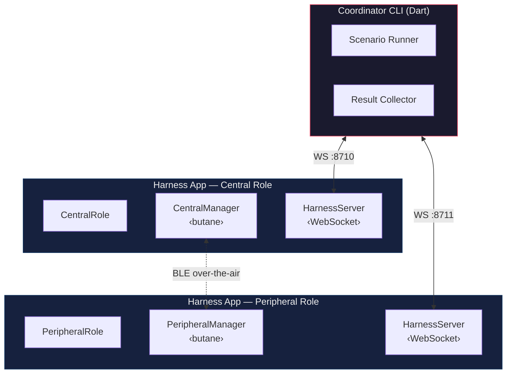
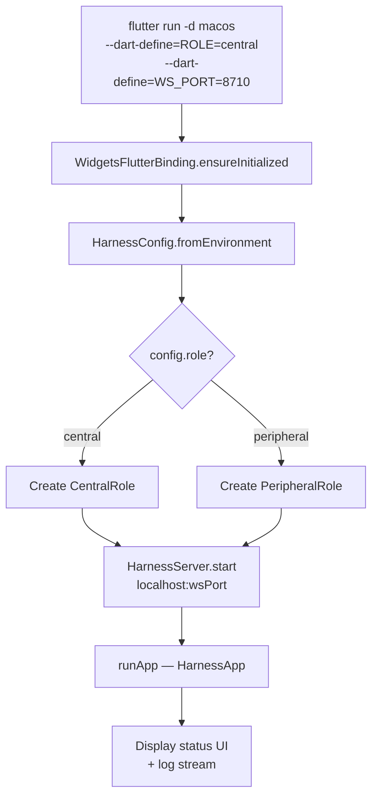
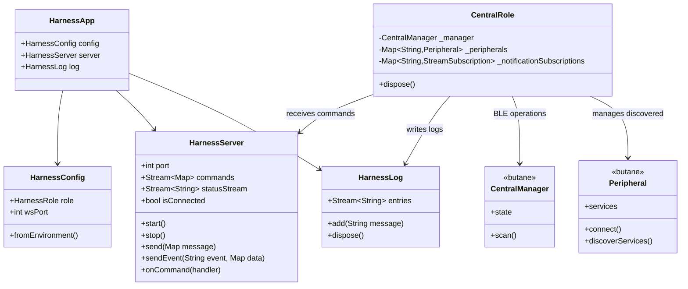
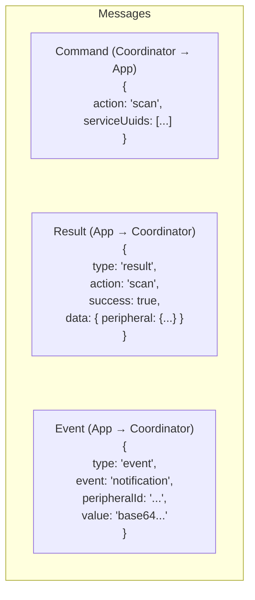

# Harness Architecture

## System Overview

The butane_flutter integration harness is a two-device BLE testing system. A **Coordinator CLI** orchestrates two instances of the same Flutter app — one running as a BLE **Central** and one as a BLE **Peripheral** — communicating test commands over WebSocket.

## App Startup Flow

Both Central and Peripheral are the **same Flutter binary**, differentiated at launch via `--dart-define`:

## Internal Component Relationships

## WebSocket Protocol

All communication between the Coordinator and the Harness apps uses JSON over WebSocket.

### Message Types

| Direction | Type | Purpose |
|-----------|------|---------|
| Coordinator → App | **Command** | Trigger a BLE operation (`action` field) |
| App → Coordinator | **Result** | Response to a command (`success` + `data` or `error`) |
| App → Coordinator | **Event** | Unsolicited push (e.g. BLE notification received) |

### Connection Rules

- Only **one** coordinator connection per app instance (subsequent connections are rejected)
- Commands are dispatched via `onCommand` handler — one handler at a time
- Results are sent automatically after command execution
