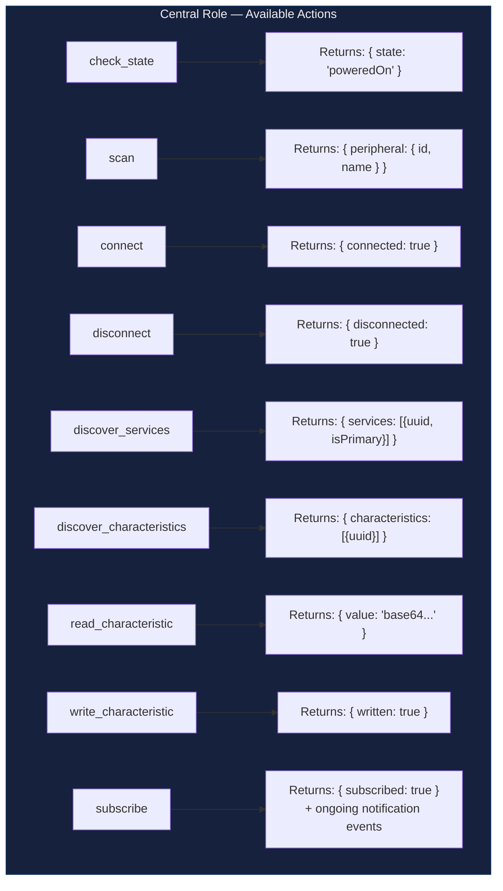
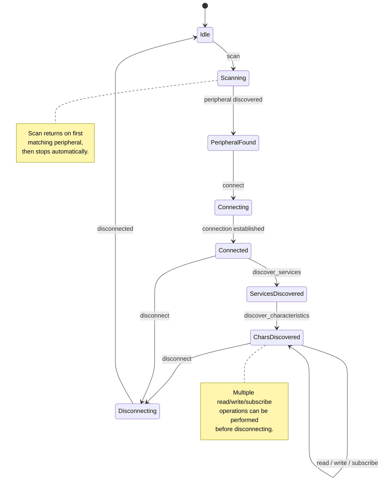
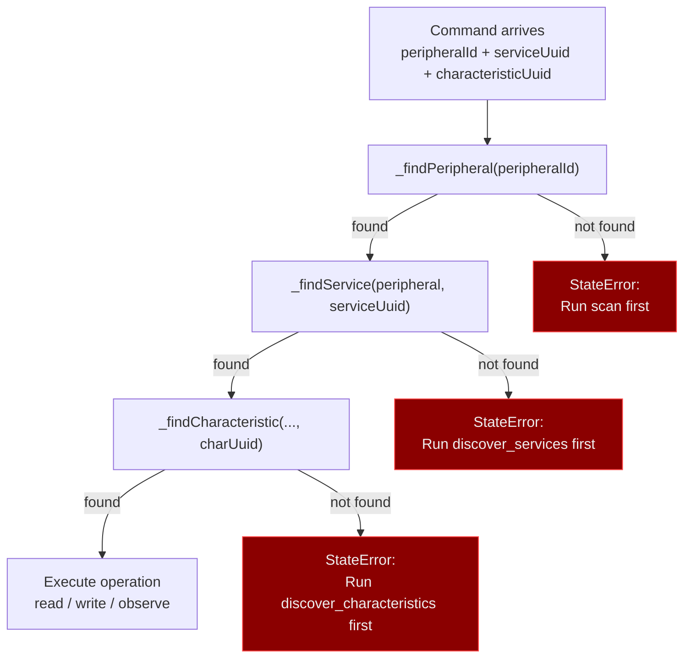
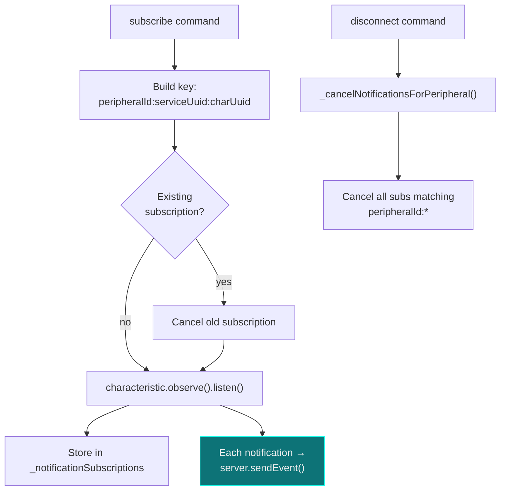

# Harness Command Reference

## Central Role Commands

All commands available when the harness app is running in `central` mode.

### Command Parameters

| Action | Required Params | Optional Params |
|--------|----------------|-----------------|
| `check_state` | — | — |
| `scan` | — | `serviceUuids: string[]` |
| `connect` | `peripheralId: string` | — |
| `disconnect` | `peripheralId: string` | — |
| `discover_services` | `peripheralId: string` | `serviceUuids: string[]` |
| `discover_characteristics` | `peripheralId: string`, `serviceUuid: string` | `characteristicUuids: string[]` |
| `read_characteristic` | `peripheralId`, `serviceUuid`, `characteristicUuid` | — |
| `write_characteristic` | `peripheralId`, `serviceUuid`, `characteristicUuid`, `value` (base64) | `withoutResponse: bool` |
| `subscribe` | `peripheralId`, `serviceUuid`, `characteristicUuid` | — |

## Central Command State Machine

Commands must follow a specific order — you can't read a characteristic before discovering it.

## Peripheral Lookup Chain

The Central role maintains a cache of discovered peripherals and navigates the GATT hierarchy for each operation:

## Notification Subscription Management

