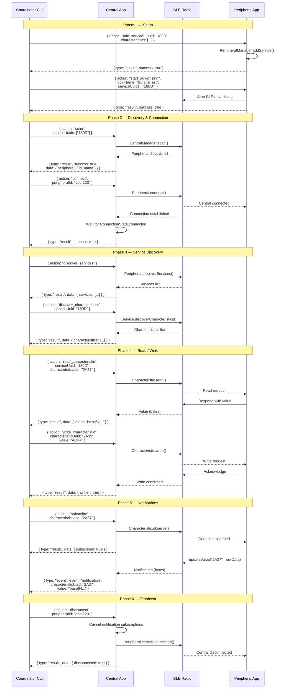
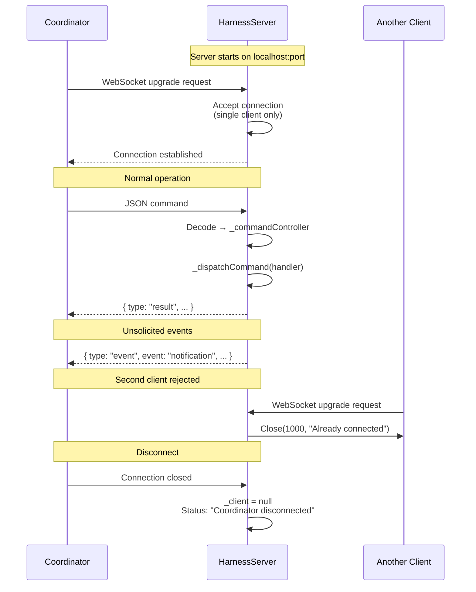
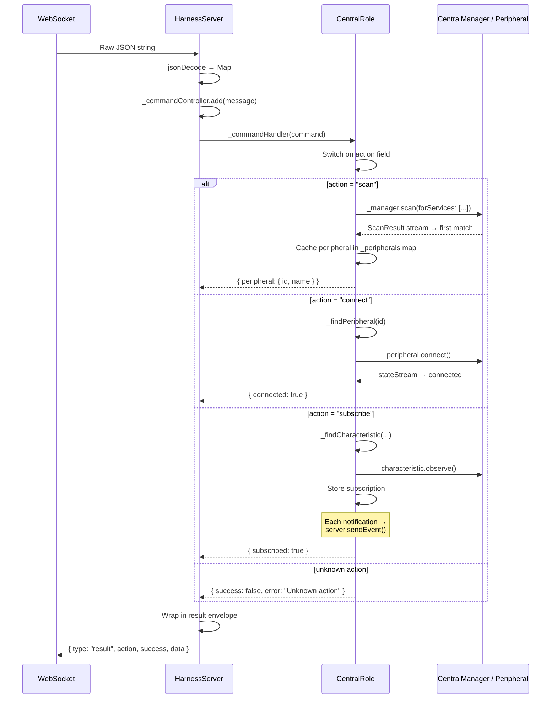
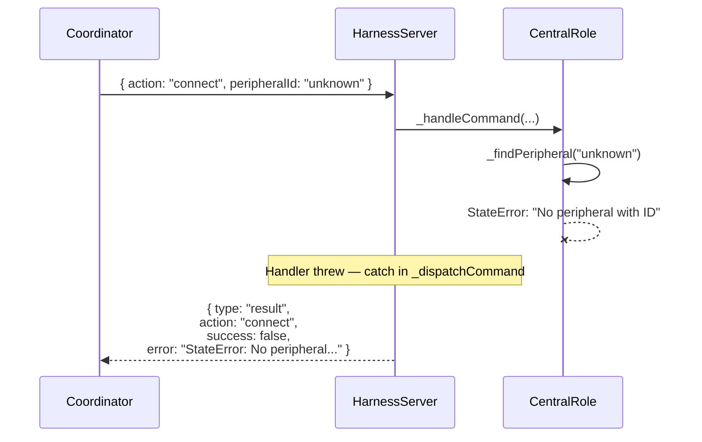
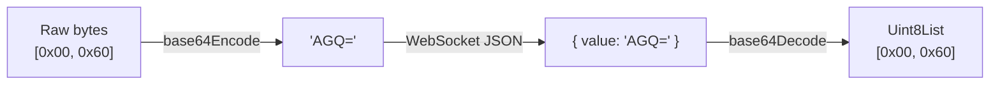

# Harness Sequence Diagrams

## Full BLE Integration Test Flow

End-to-end sequence showing the coordinator orchestrating a complete BLE test scenario: scan → connect → discover → read → write → subscribe → notify → disconnect.

## WebSocket Connection Lifecycle

## Command Dispatch Flow

How a single command flows through the Central role:

## Error Handling Flow

## Data Encoding Convention

All byte values (characteristic reads, writes, notifications) are encoded as **base64** strings in the WebSocket JSON protocol:

